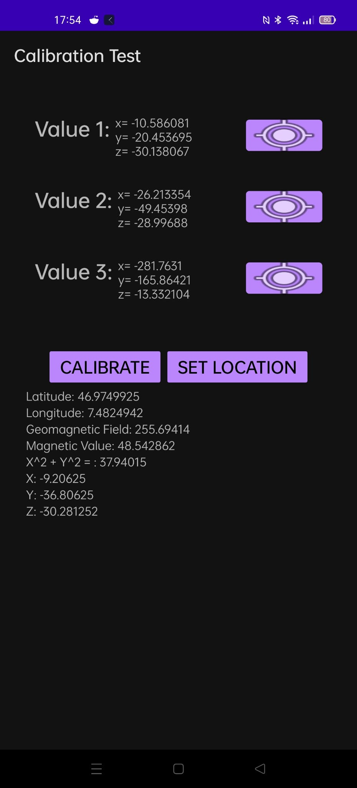

# Magnetsensor-Testing-App

This App helped me to measure the different magnetic-values. The GPS is essential
because of the magnet-field based on your geolocation.

Hope it helps you in any form.

## Little information on the side

The value x^2 + y^2 is not just the addition of those values. It's the value and
the sqrt of this sum (text->x^2 + y^2 = sqrt(x^2 + y^2)).
Sorry for the bad visualisation.

